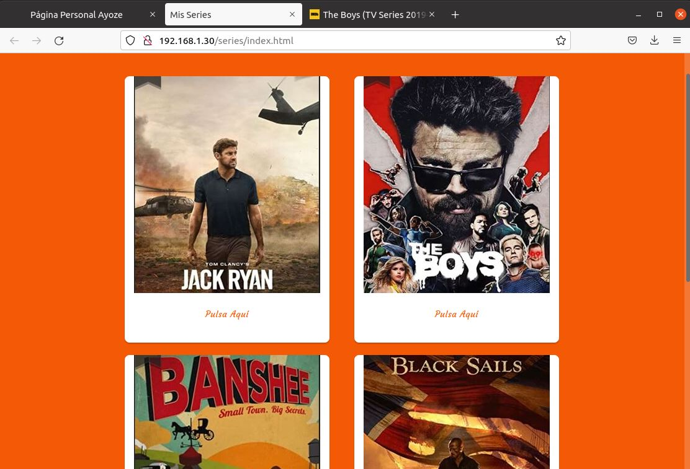

# UT1-A1. Mis Series Favoritas.

Previamente habiendo instalado Nginx en nuestra máquina, comprobamos si se esta ejecutando.

Ahora eliminamos el enlace web por defecto (default), situandonos en la carpeta /etc/nginx/sites-enabled.

Dentro de nuestro directorio /home vamos a crear las carpetas /webapps/series y alojaremos nuestra página web dentro de la misma.

En el directorio /etc/nginx/sites-available vamos a crear un nuevo fichero llamado alua83p64100j.me con el siguiente contenido.

Ahora enlazaremos ese fichero con el directorio /etc/nginx/sites-enabled.

Vamos a comprobar que es visible desde nuestro navegador.

Aun no podemos visualizar la página mediante el dominio porque no hemos mapeado la ip en nuestras dns. Para ello vamos a editar el archivo de configuración /etc/hosts y añadiremos nuestra ip y el nombre de dominio al que apunta.

Comprobamos de nuevo esta vez mediante nuestro dominio.

