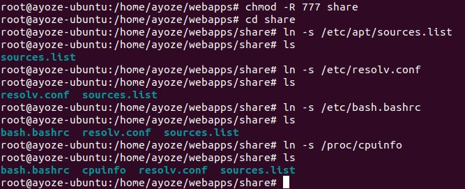

# UT1-A2. Listado de directorios.
Vamos a crear en nuestro servidor web una carpeta compartida en la cual alojaremos algunos archivos del sistema.
Una vez creada, concedemos permisos y nos dirigimos al directorio para crear los enlaces simbolicos a los archivos que queremos compartir.

Modificamos el fichero /etc/nginx/sites-available/aluA83P64100.me para añadirle el nuevo directorio. Y comprobamos que no tiene errores de sintaxis antes de recargar Nginx.

Ya tan solo nos queda acceder mediante el navegador a nuestro nuevo directorio.

