**UT1.A3: Trabajando con virtual hosts**

*Sitio web 1*

Nuestro primer hosts debe mostrar la imagen del diagrama de trabajo de IMW, así como un enlace al Real decreto de ASIR.

Para ello, crearemos el directorio ***/home/ayoze/webapps/mec***, donde alojaremos nuestro fichero html.
Una vez creado el html con la imagen y el enlace requeridos, vamos a la terminal y creamos el fichero de configuración del sitio web.

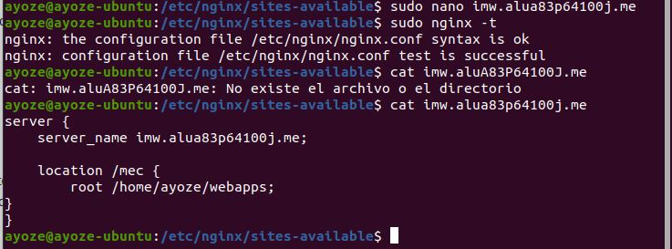

En el fichero ***/etc/hosts*** añadimos el nombre de nuestro servidor con la ip a la que apunta.

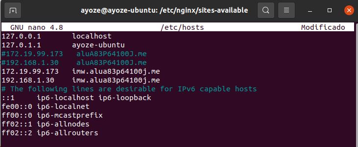

ya tan solo nos queda crear el enlace simbolico y recargar el servcio para que los cambios surjan efecto y podemos acceder mediante el navegador.

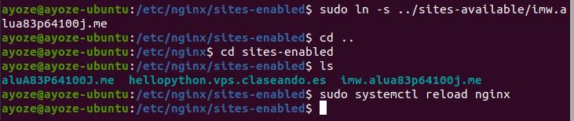

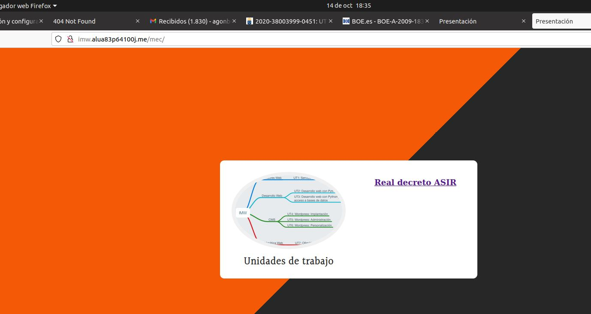

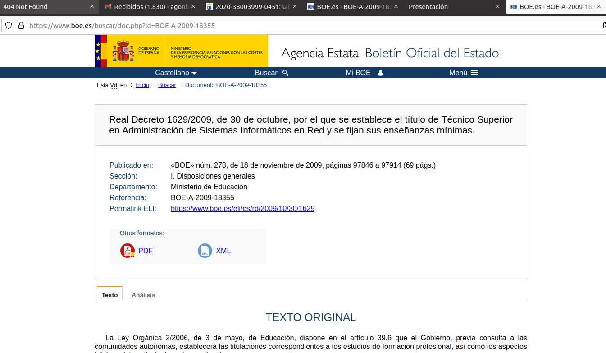

*Sitio web 2*

Para nuestro segundo hosts, queremos mostrar el listado de ficheros y directorios de /var/lib de la máquina de producción.     
Para ello, despues de incluir nuestro nombre de hosts en */etc/hosts*,  nos dirigimos a escribir nuestro fichero de configuración.

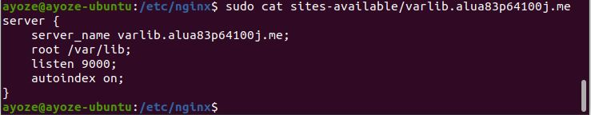

Creamos el enlace simbolico y recargamos el servicio.

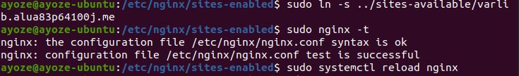

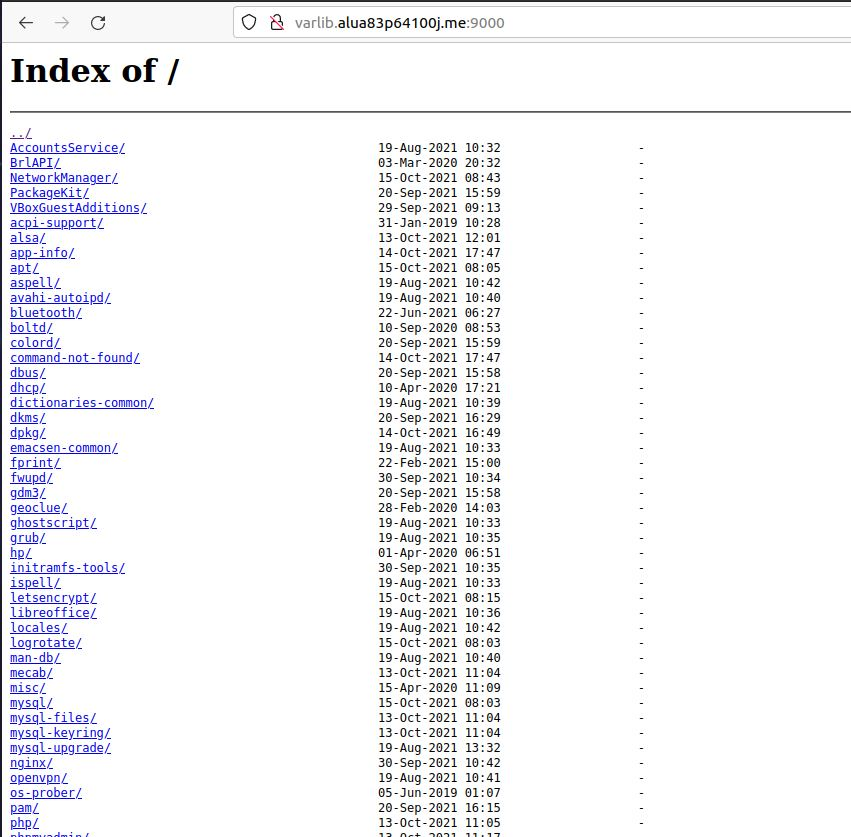

*Sitio web 3*

En esta ocasión queremos que al acceder a nuestra web, podamos visualizar los nombre de los alumnos de 2º de ASIR, no sin antes pedirnos usuario y contraseña.

Como siempre creamos nuestro directorio de trabajo y nuestro fichero html.

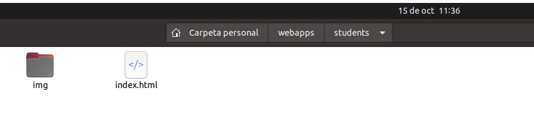

Ahora desde la terminal, vamos a encriptar nuestra contraseña y una vez hecho crearemos nuestro fichero .htpasswd con la contraseña generada y nuestro usuario para acceder a la web.

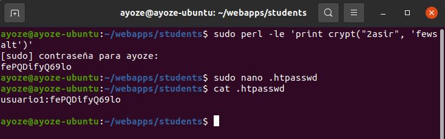

Para mayor seguridad, en el fichero de configuración añadiremos una linea para restringir el acceso al fichero .htpasswd.

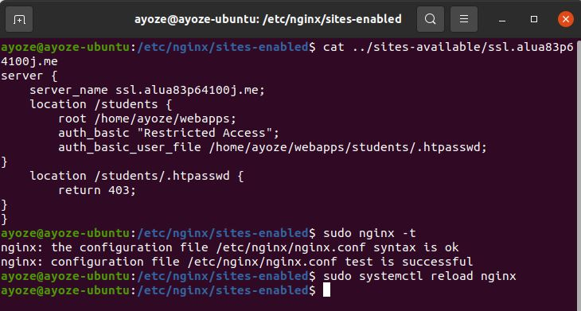

Como podemos comprobar al intentar acceder a la web nos solicita identificarnos.

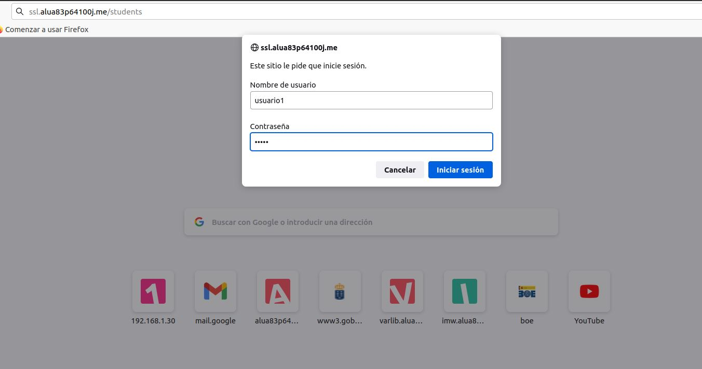

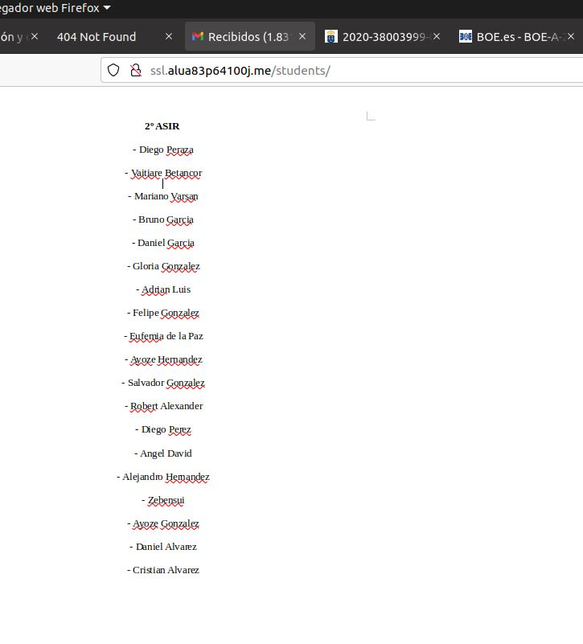

Y al intentar acceder al fichero .htpasswd nos devuelbe un mensaje de error.

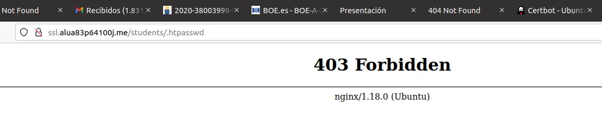

*Sitio web 4*

Para nuestra última web, queremos que al intentar acceder a las webs **http://redirect.alua83p64100j.me/test/, http://redirect.alua83p64100j.me/hola/, http://redirect.alua83p64100j.me/probando/** nos redirija a la web **http://target.alua83p64100j.me**.

Para empezar, crearemos el directorio **/var/log/nginx/redirect**, donde queremos alojar los ficheros **error.log** y **access.log**.

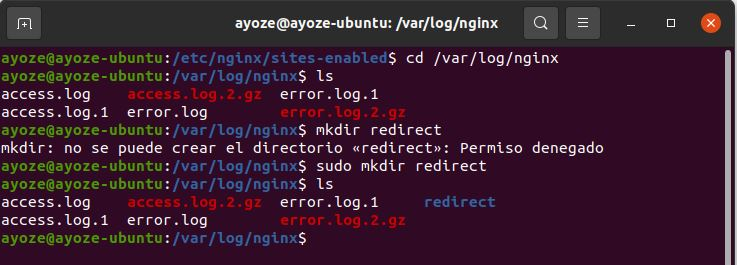

Una vez creados los diferentes directorios de trabajo y alojada la web, pasamos a crear nuestro fichero de configuración para el dominio **redirect...**

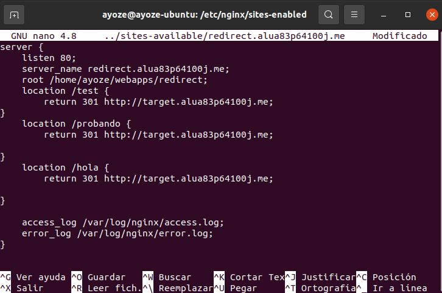

Una vez completado haremos otro fichero para el dominio **target...**

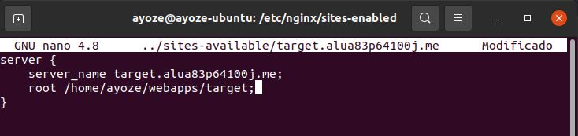

añadimos los nuevos hosts en el fichero de configuración de Dns, creamos los enlaces simbólicos en **..sites-enabled**, y recargamos el servidor.

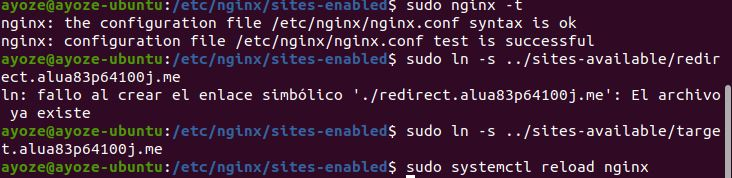

Ahora al intentar acceder a cualquiera de los 3 dominios especificados veremos como nos redirige a **target.alua83p64100j.me**.

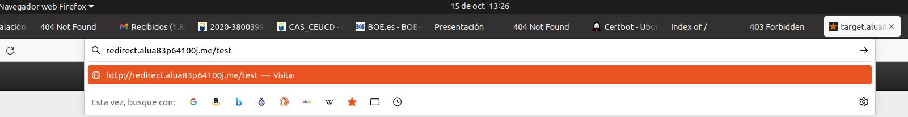

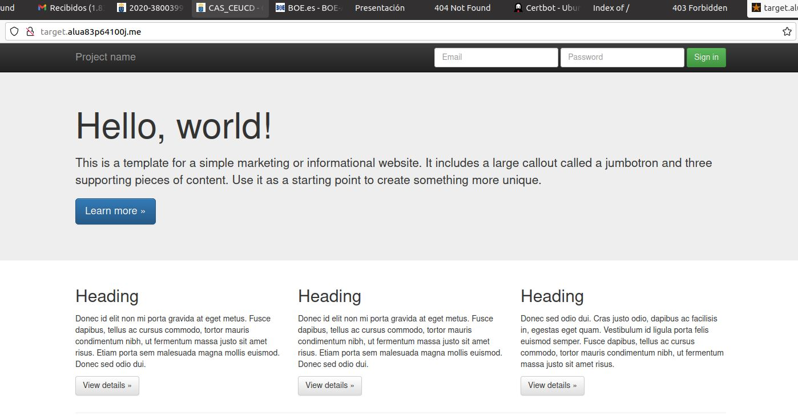
