

# UT4-A1: Implantación de Wordpress

***Ayoze Glez. Bello***

*** 2º de Ciclo Superior de Administración de Sistemas Informáticos en Red.***

### ÍNDICE

+ [Introducción](#id1)
+ [Objetivos](#id2)
+ [Material empleado](#id3)
+ [Desarrollo](#id4)
+ [Conclusiones](#id5)

#### ***Introducción***. 

WordPress es un sistema de gestión de contenidos (CMS) que permite crear y mantener un blog u otro tipo de web.
Con casi 10 años de existencia y más de un millar de temas (plantillas) disponibles en su web oficial, no es solo un sistema sencillo e intuitivo para crear un blog personal, sino que permite realizar toda clase de web más complejas.

#### ***Objetivos***. 

Vamos a implementar ***Wordpress*** en nuestro servidor de ***Azure***, para gestionar nuestras páginas web.

#### ***Material empleado***. 

- Servidor Azure
- Ubuntu (enlace ssh)

#### ***Desarrollo***. 

Lo primero que haremos trás actualizar los repositorios es instalar ***Mysql*** y acceder al servicio para crear la base de datos para wordpress. A su vez crearemos el usuario y contraseña para el servicio comonse muestra en la imagen.

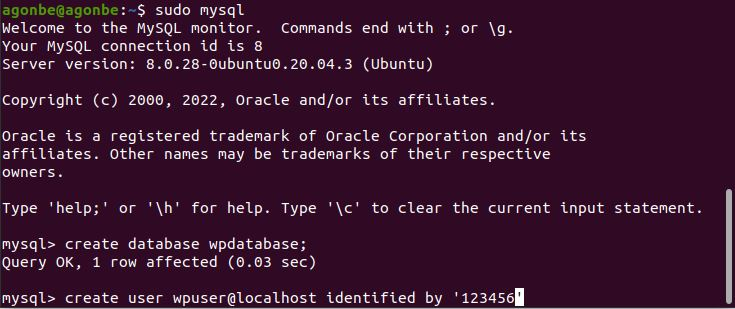

Concedemos todos los privilegios sobre la base de datos a nuestro usuario local.

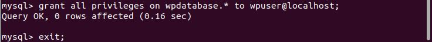

Y una vez configurada la base de datos, ya podemos descargar ***WordPress***

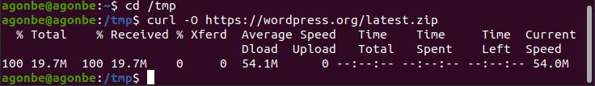

Copiamos el archivo en la ruta que usa wordpress por defecto ***/usr/share/wordpress*** yu asignamos a wordpress como nuevo propietario de la base de datos que hemos creado en pasos anteriores.

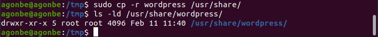

Ahora vamos a editar el archivo de configuración de wordpress ***wp-config.php*** para definir los parámetros de la base de datos.

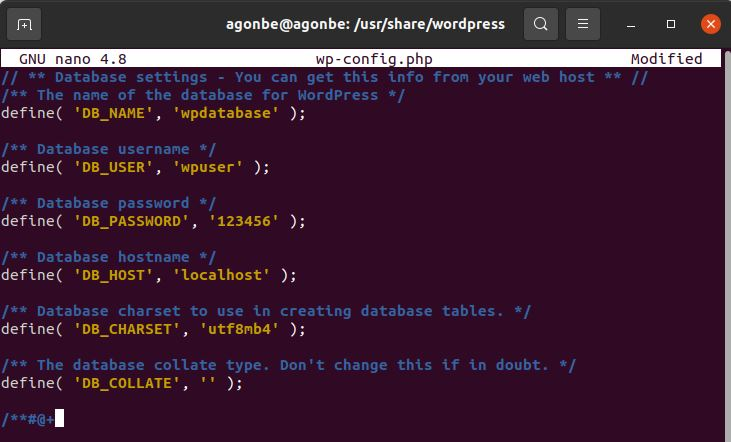

Ahora vamos a editar una nuevo sitio en  nuestro servidor ***nginx*** al que llamaremos como nuestro dominio para wordpress.

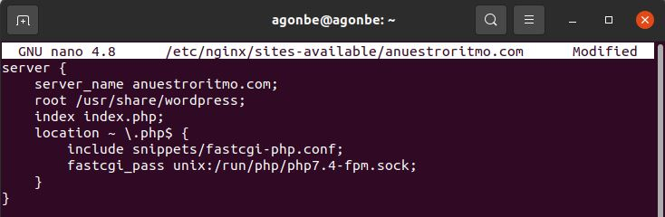

Una vez creado el sitio y el enlace simbolico a sitios disponibles, recargamos nginx para que cargue los cambios.

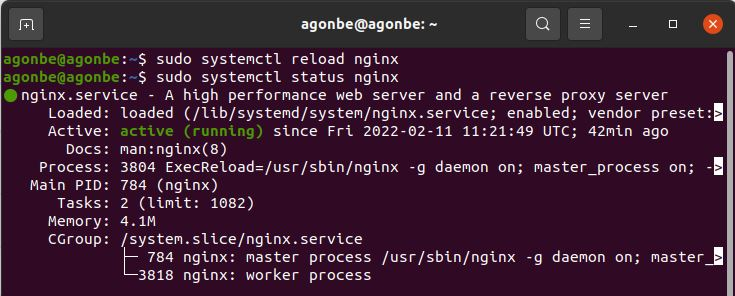

Ahora si hemos gestionado bien el dominio deberia de cargar el asistente de wordpress y trás unos pocos pasos estaremos listo para empezar a configurar nuestra página.

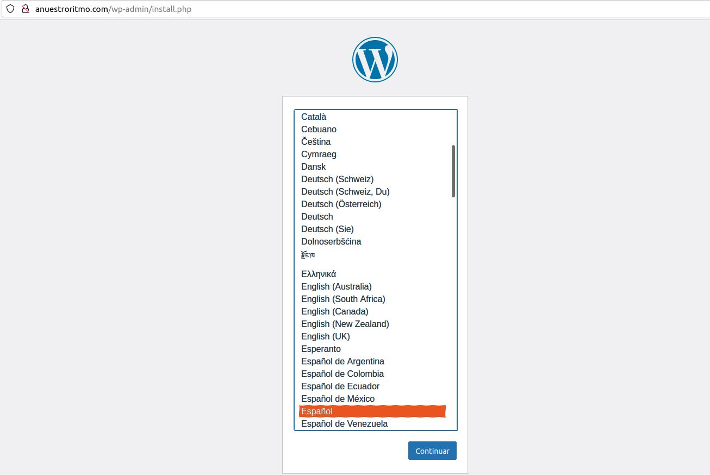

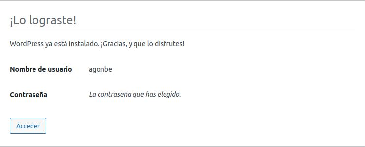

Una vez dentro de la página de administración nos dirigimos a ***enlaces permanentes*** y marcamos la opción de ***Dia y nombre***

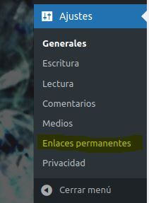

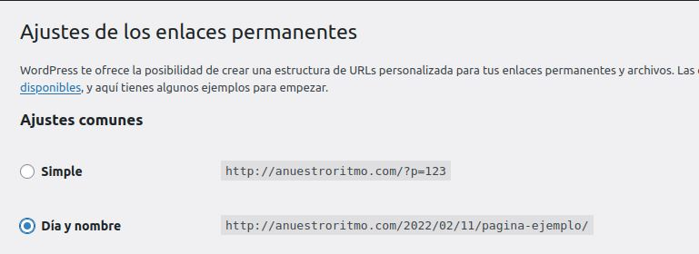

Ahora debemos indicarle a nginx que procese estas Url's añadiendo la siguiente linea al archivo de configuración.

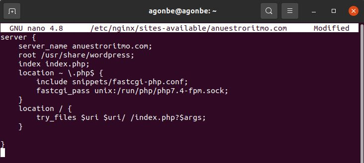

Por defecto el tamaña de subida de archivos se establece en 2mb, por ello vamos a cambiar los ajustes en el archivo de configuración de php cambiando las siguientes lineas.

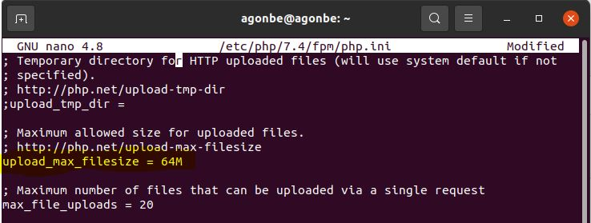

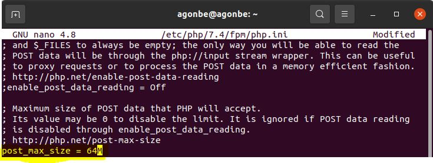

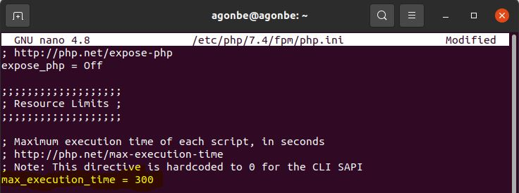

Una vez modificado el fichero, recargamos el servicio.

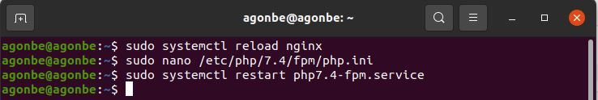

Nos falta añadir una linea al fichero de ***nginx*** para completar la configuración. Ahora recargamos el servicio y ¡lo tenemos todo listo!

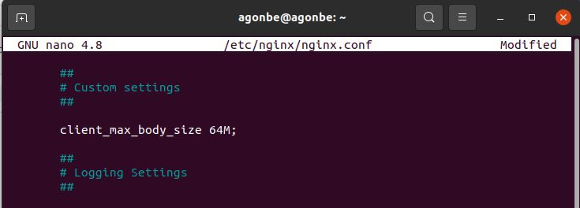

#### ***Conclusiones***. 

Usar este tipo de gestor de contenidos se ha vuelto muy popular por la facilidad de implementación y las posibilidades que brinda de personalización sin necesidad de saber nada en absoluto de ***html5 o ccs3*** con unos pocos pasos, puedes tener una web profesional con muy poco esfuerzo.
